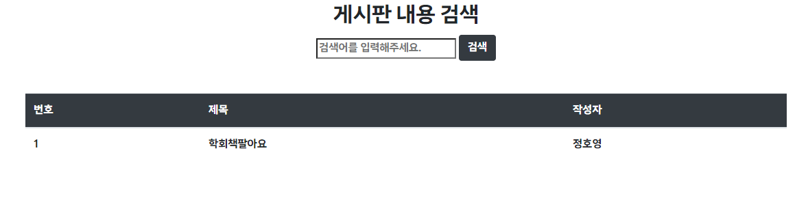

# I'mPort project

`2023년 2학기 정보통신공학과 학회 advICE`에서 학습한 내용입니다.

### 프로젝트 ERD

<details>
<summary> 프로젝트 ERD 접기/펼치기</summary>


</details>

### 프로젝트 트리

<details>
<summary>프로젝트 구조 접기/펼치기</summary>

```
iamport
├─ .gitignore
├─ gradle
│  └─ wrapper
│     ├─ gradle-wrapper.jar
│     └─ gradle-wrapper.properties
├─ gradlew
├─ gradlew.bat
└─ src
   ├─ main
   │  ├─ generated
   │  ├─ java
   │  │  └─ com
   │  │     └─ example
   │  │        └─ iamport
   │  │           ├─ Application.java
   │  │           ├─ controller
   │  │           │  ├─ ApiController.java
   │  │           │  ├─ MyController.java
   │  │           │  └─ PaymentsApiController.java
   │  │           ├─ data
   │  │           │  ├─ dto
   │  │           │  │  ├─ BoardDto.java
   │  │           │  │  ├─ BoardResDto.java
   │  │           │  │  ├─ CommonResponseDto.java
   │  │           │  │  ├─ MemberJoinDto.java
   │  │           │  │  ├─ MemberLoginDto.java
   │  │           │  │  ├─ ProductBuyDto.java
   │  │           │  │  └─ same
   │  │           │  │     ├─ BoardSameDto.java
   │  │           │  │     ├─ MemberSameDto.java
   │  │           │  │     └─ ProductSameDto.java
   │  │           │  └─ entity
   │  │           │     ├─ Board.java
   │  │           │     ├─ Member.java
   │  │           │     ├─ PaymentInfo.java
   │  │           │     └─ Product.java
   │  │           ├─ repository
   │  │           │  ├─ BoardRepository.java
   │  │           │  ├─ MemberRepository.java
   │  │           │  ├─ PaymentRepository.java
   │  │           │  └─ ProductRepository.java
   │  │           └─ service
   │  │              ├─ BoardService.java
   │  │              ├─ MemberService.java
   │  │              └─ PaymentsService.java
   │  └─ resources
   │     ├─ application.yml
   │     ├─ static
   │     │  ├─ asset
   │     │  │  ├─ advICE_plan.png
   │     │  │  ├─ boy.png
   │     │  │  └─ girl.png
   │     │  └─ js
   │     │     └─ payment.js
   │     └─ templates
   │        ├─ board.html
   │        ├─ boardView.html
   │        ├─ index.html
   │        └─ login.html
   └─ test
      └─ java
         └─ com
            └─ example
               └─ iamport
                  └─ ApplicationTests.java

```
</details>

### 동작 과정 확인

<details>
<summary> 동작과정 확인</summary>

기본 세팅은 다음과 같이 되어 있다고 가정.

**\[Member Table]**

**\[Product Table]**

**\[Board Table]**


1. 로그인 

url 주소: http://localhost:8080/login


2. 세션 연결상태 확인

루트 주소에 들어갔을 시, 현재 접속해 있는 세션의 정보를 인텔리제이 콘솔에 띄우도록 설계함.


3. 로그아웃

url 주소 : http://localhost:8080/logout
다음 주소를 요청하면 세션이 끊게 됨.


4. 게시판 화면

기본 세팅에 따르면 게시판 화면은 다음과 같음.


판매자가 정호영이기에 홍길동으로 로그인


5. 상품 구매

게시글 상세 페이지에서 상품구매 버튼을 클릭함.


결제를 진행하면 다음과 같이 변경됨.

**\[Board Table]**

**\[Product Table]**


6. 구매 후 화면

url 주소 : http://localhost:8080/board

다음 주소를 요청하면 상품의 소유자가 바뀐 것을 확인할 수 있음.


</details>